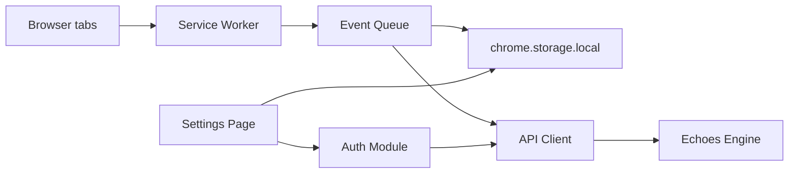

# Echoes Browser Extension — Implementation Guide

This document explains how the Chrome extension is built, how each part works, and how to test it locally. It is meant as a learning reference alongside the code.

---

## Table of contents

1. [High-level architecture](#high-level-architecture)
2. [Manifest V3 basics](#manifest-v3-basics)
3. [Project structure](#project-structure)
4. [Background service worker](#background-service-worker)
5. [Event model and queue](#event-model-and-queue)
6. [Authentication module](#authentication-module)
7. [API client](#api-client)
8. [Settings page](#settings-page)
9. [Local testing](#local-testing)
10. [Privacy design choices](#privacy-design-choices)
11. [Common extension patterns used here](#common-extension-patterns-used-here)

---

## High-level architecture

The extension follows a simple pipeline:

```text
User browses → Tab events detected → Event normalized → Queued locally → Sent to Echoes API
                      ↑                                    ↑
              Settings / consent                    Retry on failure
```



**Key idea:** the extension is only an *event source*. It captures minimal metadata (URL, title, timestamp) and forwards it. All intelligence stays on the Echoes Engine backend.

---

## Manifest V3 basics

Chrome extensions are configured by `manifest.json`. This project uses **Manifest V3**, which is the current standard.

| Field | Purpose |
|-------|---------|
| `background.service_worker` | Long-lived script that runs in the background |
| `permissions` | APIs the extension can use (`tabs`, `storage`, `alarms`) |
| `host_permissions` | Which URLs the extension may call over the network |
| `options_page` | Full settings UI opened from the toolbar icon |

### Why these permissions?

- **`tabs`** — Read tab URL and title when navigation completes or the user switches tabs. We never inject scripts into pages.
- **`storage`** — Persist auth token, consent flags, event queue, and local event log.
- **`alarms`** — Periodically flush the queue even if no new tabs are opened.

We deliberately avoid permissions like `history`, `cookies`, or `<all_urls>` content scripts because they are not needed for URL/title capture and would weaken the privacy story.

---

## Project structure

```text
echoes-browser-extension/
├── manifest.json              # Extension configuration
├── vite.config.ts             # Build setup (bundles TypeScript for MV3)
├── src/
│   ├── background/
│   │   └── service-worker.ts  # Tab listeners, orchestration
│   ├── auth/
│   │   └── auth.ts            # Login, token storage, headers
│   ├── api/
│   │   └── client.ts          # HTTP calls to Echoes API
│   ├── events/
│   │   ├── event-types.ts     # Event shape and factory
│   │   └── event-queue.ts     # Local buffer + retry logic
│   ├── settings/
│   │   ├── settings.html      # Settings UI
│   │   ├── settings.css
│   │   └── settings.ts        # Settings logic
│   └── shared/
│       └── constants.ts       # Storage keys, defaults
├── public/icons/              # Toolbar / store icons
├── mock-server/
│   └── server.js              # Local API for development
└── dist/                      # Built extension (load this in Chrome)
```

### Build tooling

Extensions cannot load raw TypeScript. [Vite](https://vitejs.dev/) bundles TypeScript into JavaScript, and [@crxjs/vite-plugin](https://crxjs.dev/vite-plugin) wires the output into a loadable extension folder under `dist/`.

```bash
npm install
npm run build      # one-off build → dist/
npm run dev        # rebuild on file changes
```

---

## Background service worker

**File:** `src/background/service-worker.ts`

In Manifest V3, background pages were replaced by **service workers** — event-driven scripts that can sleep when idle and wake on browser events.

### What triggers an event?

1. **`chrome.tabs.onUpdated`** — Fires when a tab changes. We listen for `changeInfo.status === "complete"` on the **active** tab, meaning the page finished loading.
2. **`chrome.tabs.onActivated`** — Fires when the user switches tabs. If that tab is already loaded, we capture it immediately.

### URL filtering

Internal browser pages are ignored:

```typescript
const IGNORED_URL_PREFIXES = [
  "chrome://",
  "chrome-extension://",
  "edge://",
  "about:",
  "devtools://",
];
```

This prevents capturing Chrome settings, the extension's own pages, etc.

### Consent gate

Before enqueueing anything, the worker checks:

```typescript
consent === true && trackingEnabled !== false
```

Both flags live in `chrome.storage.local` and are toggled from the settings page.

### Periodic flush

`chrome.alarms` runs every 30 seconds to retry sending queued events. This helps when the user was offline or not logged in yet.

### Toolbar click

Clicking the extension icon opens the settings page via `chrome.runtime.openOptionsPage()`.

---

## Event model and queue

**Files:** `src/events/event-types.ts`, `src/events/event-queue.ts`

### Normalized event shape

Events sent to the API match the Echoes contract:

```json
{
  "type": "WEB_VISIT",
  "timestamp": "2026-06-12T15:30:00Z",
  "source": "browser_extension",
  "metadata": {
    "url": "https://example.com",
    "title": "Example",
    "browser": "chrome"
  }
}
```

`createWebVisitEvent()` builds this object with an ISO-8601 timestamp.

### Why a queue?

Network requests can fail (offline, server down, 401 before login). The queue:

1. **Appends** each event to `chrome.storage.local` immediately (no loss on crash).
2. **Attempts delivery** via the API client.
3. **Retries** failed items up to 5 times, then drops them with a console warning.
4. **Caps size** at 500 items to avoid unbounded storage growth.

Each queued item adds:

```typescript
{ id: string; attempts: number; createdAt: string }
```

### Local event log

Separately from the send queue, a **local log** (last 100 events) is kept so users can inspect what was captured in the settings page. This supports the transparency requirement from the README.

---

## Authentication module

**File:** `src/auth/auth.ts`

### Flow

1. User enters email/password on the settings page.
2. Extension `POST`s to `{apiBaseUrl}/api/v1/auth/login`.
3. On success, the JWT (or mock token) is stored under `echoes_auth_token`.
4. Subsequent API calls include `Authorization: Bearer <token>`.

### Secure storage

Tokens are kept in `chrome.storage.local`, which is isolated to this extension and not accessible to web pages. For production you may later move to `chrome.storage.session` for shorter-lived tokens.

### Sign out

Removing the token from storage is enough. Queued events remain until the user signs in again or you explicitly clear the queue.

---

## API client

**File:** `src/api/client.ts`

A thin wrapper around `fetch`:

```typescript
POST {baseUrl}/api/v1/events
Content-Type: application/json
Authorization: Bearer <token>
Body: WebVisitEvent
```

Returns `{ ok: true }` or `{ ok: false, status?, error }` so the queue can decide whether to retry.

The default base URL is `http://localhost:3847` for local development. Users can change it in settings.

For the full endpoint list, request/response bodies, and payload schema, see **[API.md](./API.md)**.

---

## Settings page

**Files:** `src/settings/settings.html`, `settings.css`, `settings.ts`

Registered as `options_page` in the manifest — a full tab UI, not a small popup.

### Sections

| Section | Behavior |
|---------|----------|
| Privacy & consent | Must be checked before tracking can run |
| Tracking toggle | Pauses/resumes capture without uninstalling |
| Authentication | Login form, sign out, status message |
| API configuration | Override base URL for staging/production |
| Queue status | Pending count + manual flush button |
| Recent events | Read-only view of local log |

The settings script listens to `chrome.storage.onChanged` so the event list updates live while you browse in another tab.

---

## Local testing

### 1. Install dependencies and build

```bash
cd echoes-browser-extension
npm install
npm run build
```

### 2. Start the mock Echoes API

```bash
npm run mock-server
```

The server listens on **http://localhost:3847** and logs every received event to the terminal.

**Test credentials:**

| Field | Value |
|-------|-------|
| Email | `demo@echoes.local` |
| Password | `demo1234` |

**Mock endpoints:**

| Method | Path | Description |
|--------|------|-------------|
| POST | `/api/v1/auth/login` | Returns a mock bearer token |
| POST | `/api/v1/events` | Accepts events (requires auth) |
| GET | `/api/v1/events` | Lists events received by the mock server |
| GET | `/health` | Health check |

### 3. Load the extension in Chrome

1. Open `chrome://extensions`
2. Enable **Developer mode**
3. Click **Load unpacked**
4. Select the `dist/` folder (created by `npm run build`)

### 4. Configure and verify

1. Click the Echoes toolbar icon → settings open
2. Check **consent** and enable **tracking**
3. Sign in with the demo credentials
4. Visit a few normal websites (e.g. https://example.com)
5. Confirm:
   - Events appear under **Recent events (local)** in settings
   - The mock server terminal prints `event received: ...`
   - `curl http://localhost:3847/api/v1/events` shows stored payloads

### 5. Development workflow

For active development:

```bash
# Terminal 1 — mock API
npm run mock-server

# Terminal 2 — rebuild on save
npm run dev
```

After each rebuild, go to `chrome://extensions` and click **Reload** on the Echoes extension.

### Troubleshooting

| Symptom | Likely cause |
|---------|----------------|
| No events captured | Consent off, tracking paused, or URL is a `chrome://` page |
| Events in log but not on server | Not signed in — check queue status and auth section |
| `401` on send | Token missing or expired — sign in again |
| CORS errors | Mock server includes CORS headers; real API must too |
| Extension not updating | Reload unpacked extension after `npm run build` |

---

## Privacy design choices

These map directly to the README requirements:

| Requirement | Implementation |
|-------------|----------------|
| Explicit consent | Checkbox must be checked before any capture |
| Explain what's collected | Static copy on settings page; only URL + title + time |
| Disable anytime | Tracking toggle without uninstall |
| HTTPS | Production API should use `https://`; mock uses localhost only |
| Minimal local data | Token, flags, queue, and capped event log only |
| No page content | No content scripts; never read DOM or form fields |

---

## Common extension patterns used here

### 1. Service worker as orchestrator

Keep background logic thin: listen to browser events, delegate to modules. Heavy UI lives in the options page.

### 2. Storage as source of truth

`chrome.storage.local` syncs between the service worker and options page. Both read/write the same keys defined in `constants.ts`.

### 3. Fail-safe event pipeline

Always persist before send. Retry with backoff via periodic alarms. Drop after max attempts to avoid infinite loops.

### 4. Least privilege permissions

Request only `tabs`, `storage`, and `alarms`. Add new permissions only when a feature truly requires them.

### 5. Separate repo from backend

This repository builds and ships independently. The only coupling is the HTTP contract (`POST /api/v1/events` + auth header).

---

## Next steps (future enhancements)

The README lists possible follow-ups: time-on-site, domain categories, Firefox port, etc. When adding features:

- Prefer **new event types** over overloading `WEB_VISIT`
- Keep enrichment logic on the **backend**
- Re-evaluate **permissions** for each new data point
- Update consent copy whenever collection scope changes

---

## Quick reference — data flow for one page visit

1. User navigates to `https://kafka.apache.org`
2. Tab status becomes `complete`
3. Service worker checks consent + tracking flags
4. `createWebVisitEvent(url, title)` builds payload
5. Event appended to local log and send queue in storage
6. `sendEvent()` POSTs to API with bearer token
7. On success, item removed from queue; on failure, retries later

That is the full lifecycle of a single **WEB_VISIT** event in this MVP.
